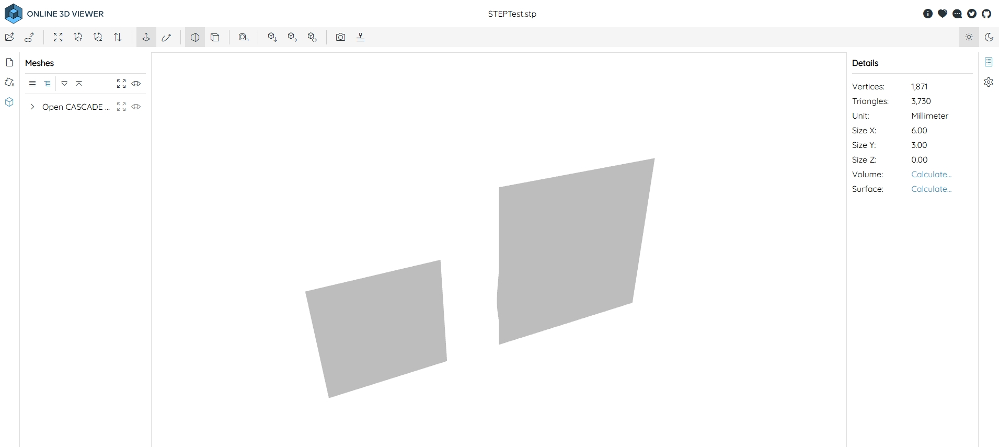
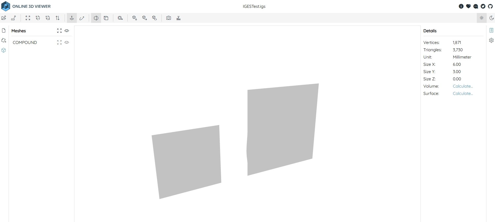

## Introduction
LNLibEx is an extension library based on C++ NURBS Algorithms Library [LNLib](https://github.com/BIMCoderLiang/LNLib). It is also a code example of [OpenCasCade](https://dev.opencascade.org/doc/overview/html/index.html) [STEP](https://dev.opencascade.org/doc/overview/html/occt_user_guides__step.html#occt_step_7)/[IGES](https://dev.opencascade.org/doc/overview/html/occt_user_guides__iges.html#occt_iges_5) translator.

## Features
### Data Exchange
- **Import STL** (either ASCII or Binary) File to _LN_Mesh_.
- **Import OBJ** File to _LN_Mesh_.
- **Export** NURBS Surfaces (_LN_NurbsSurface_) **to STEP** File. (**Based on OCCT 7.9.1**)
- **Export** NURBS Surfaces (_LN_NurbsSurface_) **to IGES** File. (**Based on OCCT 7.9.1**)

## Owner
LNLibEx is created by Yuqing Liang (BIMCoder Liang).
- bim.frankliang@foxmail.com
- 微信公众号：**BIMCoder**

## License
The source code (**except LNInternal Module**) is published under [LGPL 2.1](https://www.gnu.org/licenses/), the license is available [here](LICENSE).
